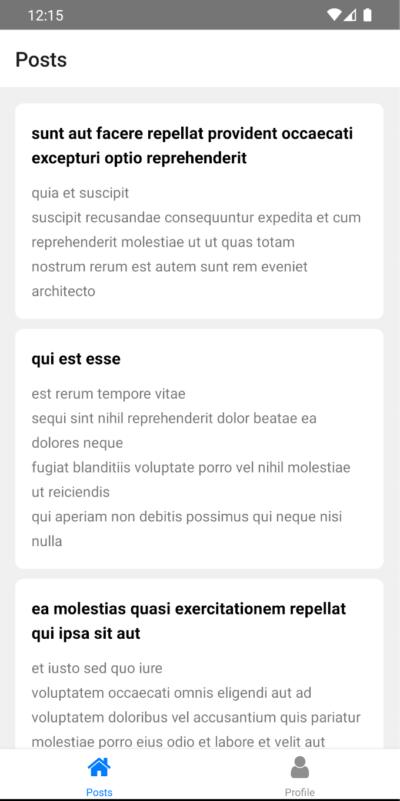
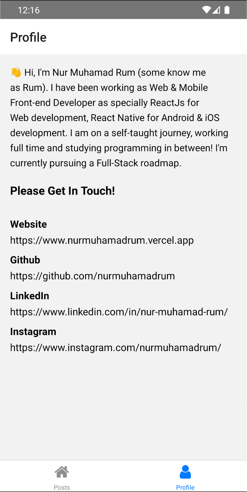

# Sekawan Media React Native

This application is a posts list article where this application is built using React Native and [JsonPlaceHolder](https://jsonplaceholder.typicode.com/) Api as the API.

## Table of Contents

- [Getting Started](#getting-started)
  - [Prerequisites](#prerequisites)
  - [Installation](#installation)
  - [Setup](#setup)
- [Screenshots](#screenshots)
- [Built With](#built-with)
- [Download APK](#download-apk-release)
- [Author](#author)

## Getting Started

Before starting to install the project, there're some things that need to be done first.

### Prerequisites

Make sure all of these are properly installed in your system.

| Application  | Download                                                                            |
| ------------ | ----------------------------------------------------------------------------------- |
| Git          | [Windows](https://gitforwindows.org/) / [Linux](https://git-scm.com/download/linux) / [MacOS](https://git-scm.com/download/mac) |
| React Native | [Link](https://facebook.github.io/react-native/docs/getting-started)                |

### Installation

First, clone this repository into your system.

```
git clone https://github.com/nurmuhamadrum/sekawanmedia.git
```

Then, install all the packages that described in `package.json`.

```
npm install
```

### Setup

For the client setup, if you are using physical device to run the app, make sure your ADB drivers already installed or you can use Android Emulator from AVD (Android Virtual Device) Manager of Android Studio (_This part should be done while installing the React Native framework_)

Then, install and run the application.

For Expo :

`npx expo start`

And for IOS :

`npm run ios`

And for Android :

`npm run android`

Wait till the application is installed and run into your device. Now, you can explore the Application and its features. Enjoy!

## Screenshots

<div style={{ display: 'flex' }}>

  
  

</div>


## Built With

- [REACT NATIVE](https://facebook.github.io/react-native/) - MOBILE FRONTEND
- [REST API](https://jsonplaceholder.typicode.com/) - JSONPLACEHOLDER API

## Download APK Release
- [GOOGLE DRIVE] (https://drive.google.com/file/d/1jKO6LzZM1a1UpLiPuxP3ExvjqEeGx2Ao/view?usp=sharing)

## Author

**Nur Muhamad Rum** - (https://nurmuhamadrum.vercel.app/)
